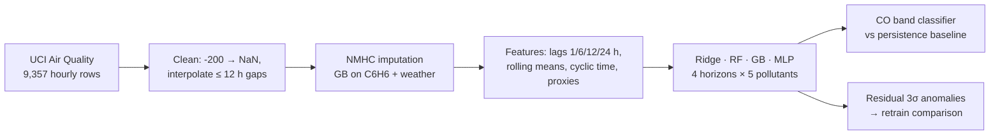

# Air Quality Forecasting and Anomaly Detection

> Team project for UNSW COMP9417 Machine Learning and Data Mining (Term 3, 2025), shown here for portfolio purposes. Source code is kept private under university academic-integrity rules; **source available on request**.

Multi-horizon forecasting (1, 6, 12 and 24 hours ahead) of five pollutants from the UCI Air Quality dataset (9,357 hourly records, one Italian city, 2004–2005), plus concentration-band classification and residual-based anomaly detection. The hard part of the data: NMHC is 90% missing and benzene has no dedicated sensor.

## Results

- Compared Ridge, Random Forest, Gradient Boosting and MLP on a time-based split; gradient boosting was best overall, with **CO short-horizon R² 0.78** and all pollutants above R² 0.75 at 24 h. (Figures follow the team report's evaluation; per-horizon tables are in the private repo.)
- **Classification of CO into low / mid / high bands beat the persistence baseline by ~22 percentage points at 6 h** (64.8% vs 42.3%) and ~20 pp at 12 h, the horizons where naive persistence collapses.
- **NMHC reconstructed** from its 10% overlap with benzene and meteorology using gradient boosting (R² 0.98 on held-out overlap), raising completeness from 10% to 98%.
- **Residual 3σ anomaly detection** flagged 12% of training samples; retraining without them improved the two stable pollutants and degraded the three variable ones, so the full-data models were kept. Feature importance: the 24-hour lag (23.8%) outranked the 1-hour lag (19.8%).

## My role

Data preprocessing lead in a team of five: timestamp reconstruction, missing-value strategy (interpolation for short gaps, exclusion for long ones), NMHC imputation, sensor-proxy feature set for benzene, cyclic time features, and the pollutant-specific lag / rolling feature pipeline (26–43 features per target).

## Pipeline

## Tech stack

Python · pandas · scikit-learn · matplotlib / seaborn · Jupyter

## Data

UCI Machine Learning Repository, Air Quality dataset (De Vito et al.), CC BY 4.0 — https://archive.ics.uci.edu/dataset/360/air+quality. Not redistributed here.

## Contributors

Team High Grade Miners: Bingcheng (Bensen) Liu (data preprocessing lead) · TODO-NAMES (modelling, classification, report)
